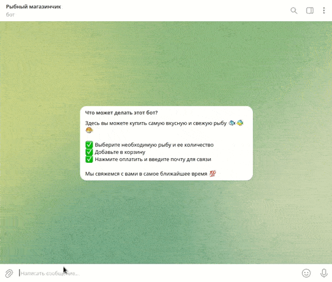

# Бот магазин по продаже рыбы.

## Описание
Интернет-магазин по продаже рыбы. Выберите нужную вам рыбку из имеющегося ассортимента и добавьте в свою корзину. Проверьте заказ и оставьте заявку на покупку. Интерфейс бота реализован на платформе [telegram](https://telegram.org/). Учет остатка товара и его администрирование реализовано на платформе для создания интернет магазинов [elasticpath](https://www.elasticpath.com/).

Доступно демо проекта. Можете запустить и покликать работающего телеграм бота [здесь](https://t.me/fish_shop_tg_bot).

## Переменные окружения

Необходимые для корректной работы бота токены беруться из переменных окружения. Чтобы их определить, создайте файл `.env` в корневой папке проекта и запишите туда данные в таком формате: `ПЕРЕМЕННАЯ=значение`:

- `TELEGRAM_BOT_TOKEN` — токен вашего телеграм бота, где будет продаваться рыба. Создать нового телеграм бота и получить токен можно у [BotFather](https://telegram.me/BotFather).

- `TELEGRAM_LOGGER_BOT_TOKEN` — токен вашего телеграм бота, в который будут приходить все логи работы ботов. Создать нового телеграм бота и получить токен можно у [BotFather](https://telegram.me/BotFather). После создания бота, запустите его, перейдя по сгенерированной ссылке и нажав кнопку `start`.
- `TELEGRAM_DEVELOPER_USER_ID` — id пользователя, кому бот будет присылать все логи работы ботов. Получить свой id можно у [этого телеграм бота](https://telegram.me/userinfobot).

- `REDIS_URL` — укажите путь к базе данных [Redis](https://redis.io/). По умолчанию, если [redis server установлен локально](https://www.digitalocean.com/community/tutorials/how-to-install-and-secure-redis-on-ubuntu-18-04-ru) url будет вида: `redis://localhost:6379?db=0`. [Подробнее](https://redis-py.readthedocs.io/en/stable/connections.html#redis.Redis.from_url).

- `MOLTIN_CLIENT_ID` — id клиента [на платформе](https://www.elasticpath.com/) для создания интернет магазинов. Получить можно в строке `Client ID` в [личном кабинете платформы](https://euwest.cm.elasticpath.com/application-keys#legacy-key), после регистрации и создания интернет магазина.
- `MOLTIN_CLIENT_SECRET` — токен клиента [на платформе](https://www.elasticpath.com/) для создания интернет магазинов. Получить можно в строке `Client Secret` в [личном кабинете платформы](https://euwest.cm.elasticpath.com/application-keys#legacy-key), после регистрации и создания интернет магазина.

## Как запустить

- Для запуска сайта вам понадобится Python третьей версии.
- Скачайте репозиторий с кодом и прилегающими файлами.
- Установите зависимости командой `pip install -r requirements.txt`.
- Убедитесь что вы создали и наполнили файл `.env` по инструкции разделом выше.
- Запустите бота в telegram командой `python3 tg_bot.py`.
